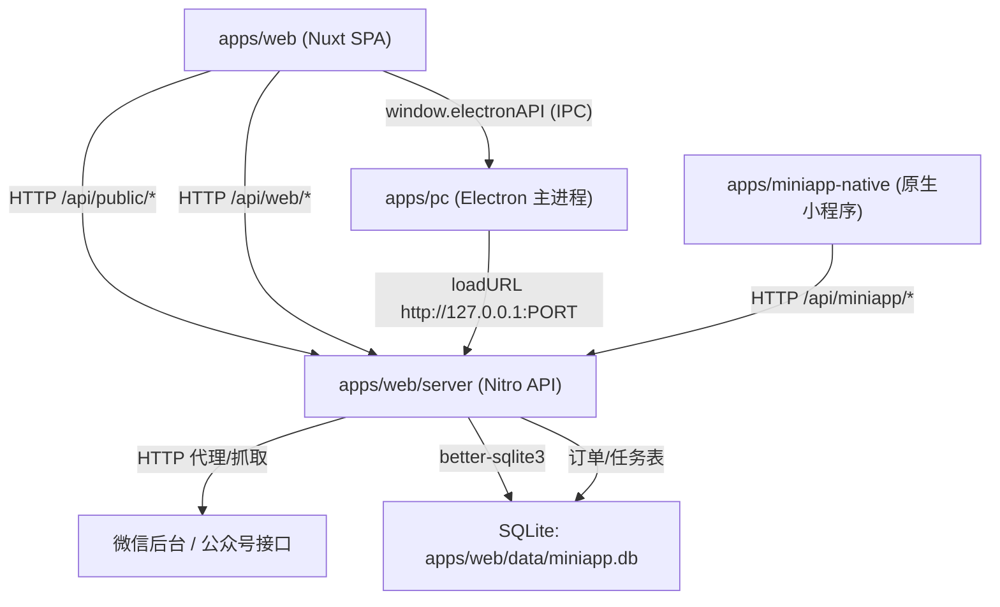

## 项目功能与总体设计

### 功能概述

- **核心目标**：批量导出微信公众号文章及其元数据（阅读量、点赞、评论等），支持多种导出格式，并提供桌面版与在线版两种使用方式。
- **主要能力**：
  - **公众号搜索与文章列表获取**
  - **文章内容抓取与解析**（图文、视频、图片分享、合集等）
  - **多格式导出**：HTML / JSON / Excel / TXT / Markdown / DOCX / EPUB（小程序电子书）
  - **数据增强**：阅读量、点赞量、转发量、评论及评论回复等
  - **缓存与筛选**：文章缓存、本地筛选与批量导出
  - **多端形态**：
    - Web SPA（浏览器端）+ Nitro API（后端）
    - Electron 桌面应用（离线导出、更好的文件访问能力）
    - 原生微信小程序（付费电子书下载）

### 高层架构

项目采用 **Monorepo** 结构，按端拆分为 `apps/*` 与共享代码 `packages/*`：

- `apps/web`：Nuxt 3 SPA + Nitro 后端（Node Server 模式）
- `apps/pc`：Electron 主进程 + 预加载脚本，与 Web 端集成
- `apps/miniapp-native`：原生微信小程序项目（公众号电子书付费小程序）
- `packages/shared`：前端与后端共享的工具函数与网络请求封装

整体调用关系（简化）：

---

## Web 端（apps/web）：Nuxt 3 SPA + Nitro 后端

### 目录结构

- `apps/web/app.vue`：应用根组件，挂载 Layout、Page、通知与模态框
- `apps/web/nuxt.config.ts`：
  - `ssr: false`，纯 SPA 模式
  - `modules`: `@nuxt/ui`, `@vueuse/nuxt`, `nuxt-monaco-editor`, `@sentry/nuxt`, `nuxt-umami`
  - `plugins`: `~/plugins/electron.client.ts`（在 Electron 环境下注入 `window.electronAPI` 类型）
  - `nitro.routeRules['/api/**'] = { cors: true }`
  - `nitro.storage.kv`：KV 存储（可配置 `NITRO_KV_DRIVER` 与 `NITRO_KV_BASE`）
  - `alias['#shared']`：指向 `packages/shared`，供前端 API 封装等复用
- 页面与组件：
  - `apps/web/pages/`：Nuxt 路由页面（首页、dashboard、dev 示例等）
  - `apps/web/components/`：分为 `dashboard/、grid/、setting/、preview/、modal/、api/、base/` 等子目录
- 状态与逻辑：
  - `apps/web/store/v2/*`：Dexie + 本地存储的文章缓存、元数据、账号信息等
  - `apps/web/composables/`：登录状态、导出器、下载器、偏好设置等自定义 hooks
- 工具函数：
  - `apps/web/utils/`：导出器、下载器、HTML 处理、并发控制、网格工具等
  - `packages/shared/utils/`：`#shared/utils/request` 等通用封装，供前端与后端共用

### 前端到后端的 API 划分

- `server/api/public/v1/*`（公开接口，主要被前端调用）：
  - `account.get.ts` / `accountbyurl.get.ts`：公众号信息查询
  - `article.get.ts`：文章详情查询
  - `download.get.ts`：文章内容导出触发
  - `authkey.get.ts`：授权/鉴权相关
- `server/api/web/*`（与微信后台/风控的交互）：
  - `login/*`：扫码登录、session 管理
  - `mp/*`：公众号后台相关接口（`searchbiz`, `appmsgpublish`, `profile_ext_getmsg` 等）
  - `misc/*`：评论获取、合集信息、当前 IP 等
  - `worker/*`：安全与代理节点监控指标
- `server/api/miniapp/*`（小程序订单相关）：
  - `create-order.post.ts`：发起小程序订单
  - `payment-callback.post.ts`：支付回调
  - `process-tasks.post.ts`：触发任务处理队列
  - `orders.get.ts` / `order-status.get.ts` / `search-biz.get.ts`：订单与任务状态查询

---

## 后端设计（apps/web/server）

### 数据库（SQLite，better-sqlite3）

- 实现文件：`apps/web/server/db/miniapp.ts`
- 物理路径：`process.cwd()/data/miniapp.db`（在 web 端运行时为 `apps/web/data/miniapp.db`）
- 表结构：
  - `orders`：
    - `id`：订单 ID（UUID）
    - `biz_name` / `biz_fakeid`：公众号名称与 fakeid
    - `email`：用户邮箱
    - `status`：`pending | paid | processing | completed | failed`
    - `amount`：金额
    - 时间戳：`pay_time` / `created_at` / `updated_at` / `completed_at`
    - `error`：错误消息
  - `tasks`：
    - `id`：任务 ID（UUID）
    - `order_id`：关联订单
    - `type`：`fetch_articles | generate_ebook | send_email`
    - `status`：`pending | processing | completed | failed`
    - `progress`：进度百分比
    - `result`：任务结果（如文章列表 JSON、生成文件路径）
    - `error`：错误消息
    - `created_at` / `updated_at`

### 任务处理与业务编排

- 实现文件：`apps/web/server/services/task-processor.ts`
- 主要职责：
  - 从 DB 中取出 `pending` 任务：`getPendingTasks()`
  - 根据 `type` 分支：
    - `fetch_articles`：模拟/实际调用微信接口获取文章列表，写入 `tasks.result`，并创建下一步的 `generate_ebook` 任务
    - `generate_ebook`：读取文章列表，生成 EPUB（`generateEpub()`），写入本地临时路径；然后创建 `send_email` 任务
    - `send_email`：读取 EPUB 文件内容，通过邮件服务（当前为模拟实现）发送给用户邮箱，并将订单状态置为 `completed`
- `generateEpub`：
  - 使用 `turndown` 将 HTML 转换为 Markdown，再转为简单的 XHTML
  - 使用 `JSZip` 手工构建 EPUB 目录结构（`OEBPS/Text/*.xhtml`, `nav.xhtml`, `content.opf`, `META-INF/container.xml`）
  - 自动生成封面 SVG，并按更新时间为文章排序

### 与微信后台的交互

- 通过 `apps/web/server/utils/proxy-request.ts` 与 `fetch_external.ts` 统一封装外部 HTTP 调用。
- `server/utils/CookieStore.ts` + `server/kv/cookie.ts` 负责持久化微信登录 cookie/凭证到 KV 存储。
- `server/api/web/mp/*` 按公众号后台接口划分路由，例如：
  - `searchbiz.get.ts`：搜索公众号
  - `appmsgpublish.get.ts`：获取文章列表
  - `profile_ext_getmsg.get.ts`：通过 credentials 抓取公众号历史文章列表

---

## Electron 桌面端设计（apps/pc）

### 启动与窗口管理

- 主进程入口：`apps/pc/main.ts`（编译为 `main.js`，在 `package.json.main` 中注册）
- 功能点：
  - 窗口状态持久化（`window-state.json`）
  - 系统托盘图标与菜单（隐藏到托盘、双击显示）
  - 顶部菜单（文件/编辑/视图/帮助）及“关于/问题反馈”等
  - 未捕获异常与未处理 Promise 拦截，统一写入 `electron-log`

### 与 Web 端的集成方式

- **开发模式**：
  - `NODE_ENV=development` 或命令行含 `--dev` 时：
    - 直接 `loadURL('http://localhost:3000')`
    - 自动打开 DevTools
- **生产模式**：
  - Electron 主进程在应用目录下启动 Nuxt Nitro server：
    - 入口：`apps/web/.output/server/index.mjs`
    - 通过 `child_process.spawn(process.execPath, [serverEntry])` 启动
    - 环境变量：`HOST=127.0.0.1`、`PORT`（默认 38765，可通过 `PORT` 覆盖）
    - 使用 `net.Socket` 轮询等待端口可用，再执行 `loadURL(http://127.0.0.1:PORT)`
  - 退出时尝试 `kill` web server 子进程

### IPC 与预加载脚本

- 预加载脚本：`apps/pc/preload.ts`
  - 使用 `contextBridge.exposeInMainWorld('electronAPI', electronAPI)` 向 renderer 注入安全 API
- 渲染端类型声明与 Nuxt 插件：`apps/web/plugins/electron.client.ts`
  - 提供 `ElectronAPI` TypeScript 接口
  - 在客户端检测 `window.electronAPI` 是否存在，并打印 “Running in Electron environment”
- 主进程 IPC handler（`main.ts`）：
  - 对话框：`dialog:showSaveDialog`、`dialog:showOpenDialog`
  - 文件操作：`fs:writeFile`、`fs:writeFileFromBlob`、`fs:ensureDir`
  - 应用信息：`app:getPath`、`app:getVersion`
  - 窗口控制：`window:minimizeToTray`
  - 通知：`notification:show`
  - 菜单事件：向 renderer 发送 `menu:export-settings` 事件
- 典型使用场景（以导出为例）：
  - 前端调用 `export2ExcelFile()`（`apps/web/utils/exporter.ts`）
  - 若检测到 `window.electronAPI`，则：
    - 弹出系统保存对话框
    - 将生成的 Blob 转 Base64，通过 `writeFileFromBlob` IPC 写入本地文件

---

## 小程序端设计（apps/miniapp-native）

### 项目结构

- 标准微信原生小程序结构：
  - `app.js / app.json / app.wxss`
  - `pages/index/index.*`：首页（选择公众号、介绍说明）
  - `pages/order/order.*`：单个订单详情
  - `pages/orders/orders.*`：订单列表
  - `api/request.js`：对 `wx.request` 的轻量封装
  - `config/index.ts`：小程序配置（如后端 API 地址）

### 与后端交互

- 所有业务接口通过 `apps/web` 的 `/api/miniapp/*` 路由访问：
  - `create-order.post.ts`：创建订单（下单）
  - `payment-callback.post.ts`：模拟/对接真实支付回调
  - `orders.get.ts` / `order-status.get.ts`：订单列表与状态查询
  - `process-tasks.post.ts`：触发任务流水执行（抓取文章 -> 生成 EPUB -> 邮件发送）
- 小程序端负责：
  - 展示订单进度（`pending/processing/completed/failed`）
  - 让用户在支付成功后能查看并下载电子书（通过邮箱收取）

---

## 共享代码与工具（packages/shared）

- `packages/shared/utils/request.ts`：
  - 封装 `$fetch`，统一重试策略（当前 `retry: 0`）与基础配置
  - 提供在客户端与服务端两端均可使用的 HTTP 请求入口
- 其他工具：
  - `helpers.ts`：格式化函数、通用处理逻辑
  - `html.ts` / `renderer.ts`：HTML 渲染与内容处理相关工具
- 使用方式：
  - 通过 Nuxt alias `#shared` 引入，例如：
    - `import { request } from '#shared/utils/request'`
  - 便于未来将相同逻辑复用于 CLI、后台脚本或其他 workspace。

---

## 部署与运行

### Web/Nitro（Docker）

- Dockerfile（两阶段）：
  - **构建阶段**：
    - 基于 `node:22-alpine`
    - 启用 `corepack` + 固定 Yarn 版本
    - `COPY package.json yarn.lock ./`
    - `yarn install --frozen-lockfile --production=true`
    - `COPY . .`
    - `RUN yarn web:build`（在 `apps/web` 下执行 `nuxt build`，生成 `.output`）
  - **运行阶段**：
    - 基于 `node:22-alpine`
    - `COPY --from=build-env /app/apps/web/.output ./`
    - 以非 root 用户 `node` 运行
    - 暴露端口 3000，入口为 `node server/index.mjs`

### Electron 桌面应用

- 构建：
  - `yarn build:electron`：
    - `yarn web:build`
    - `tsc -p apps/pc/tsconfig.json`
    - `electron-builder` 根据 `package.json.build` 打包
  - 打包文件包含：
    - `apps/web/.output/**/*`
    - `apps/pc/**/*`
    - 项目 `package.json`
- 运行：
  - 开发：`yarn dev:electron`（Nuxt dev + Electron TS watch）
  - 直接启动：`yarn electron:start` 或 `start-electron.ps1`

### 原生小程序

- 使用微信开发者工具：
  - 导入项目路径：`apps/miniapp-native`
  - AppID/名称配置按实际环境填写
  - 小程序通过网络访问部署在服务器上的 `/api/miniapp/*` 接口

---

## 启动入口快捷说明

- **Web 开发调试**：`yarn web:dev`
- **Web 生产构建**：`yarn web:build`
- **Electron 开发调试**：`yarn dev:electron`
- **Electron 单独启动（需先构建 TS）**：`yarn electron:start`
- **原生小程序**：在微信开发者工具中导入 `apps/miniapp-native` 目录即可预览/调试

